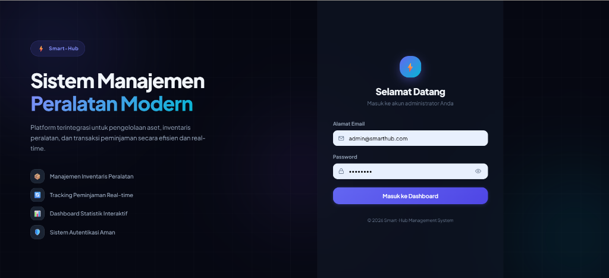
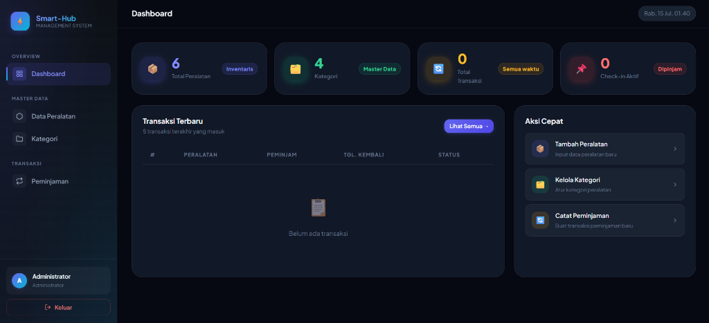
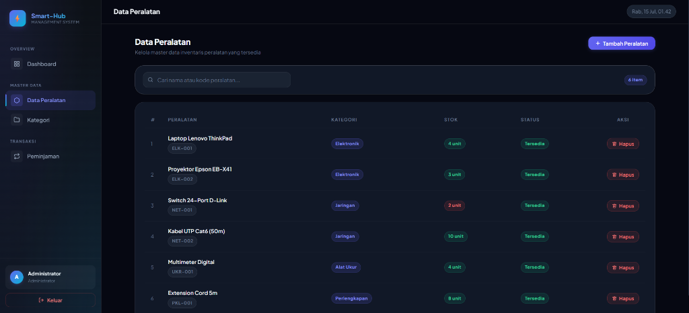
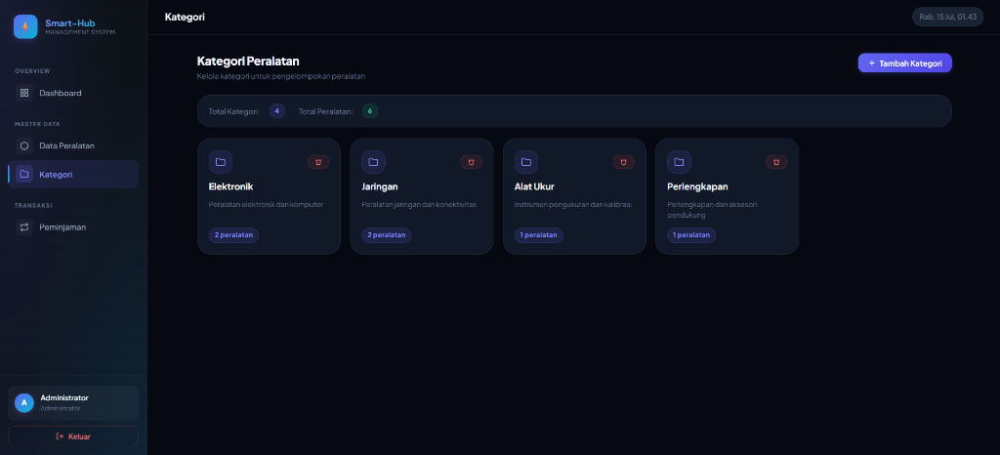
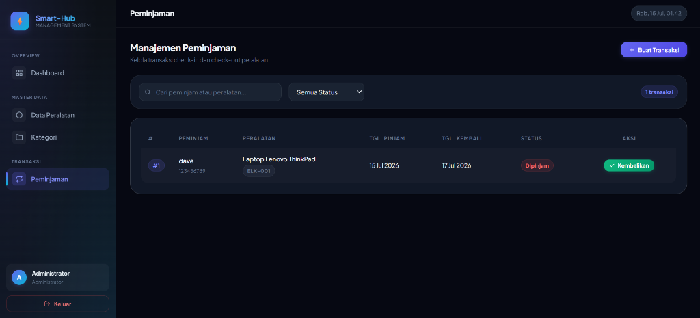

# Smart-Hub Management System ⚡

Smart-Hub Management System adalah platform terintegrasi untuk pengelolaan aset, inventaris peralatan, dan transaksi peminjaman secara efisien dan *real-time*. Proyek ini dikembangkan untuk memenuhi tugas UAS Pemrograman Fullstack.

## 🚀 Fitur Utama
*   **📦 Manajemen Inventaris Peralatan:** Kelola data peralatan, kategori, dan pantau stok secara otomatis.
*   **🔄 Tracking Peminjaman Real-time:** Pencatatan peminjaman (Check-in) dan pengembalian (Check-out) yang akurat.
*   **📊 Dashboard Statistik Interaktif:** Tampilan ringkasan transaksi, status stok, dan log terbaru yang mudah dipahami.
*   **🛡️ Sistem Autentikasi Aman:** Login khusus administrator (Monolith Architecture dengan Laravel Authentication).
*   **💎 UI/UX Premium:** Antarmuka responsif dan modern dengan gaya *Glassmorphism*, typography elegan (Plus Jakarta Sans), dan SVG Icons.

## 📸 Tampilan Layar (Screenshots)

### Halaman Login


### Dashboard


### Data Peralatan


### Kategori


### Peminjaman

## 💻 Tech Stack
*   **Backend:** Laravel 13 (PHP)
*   **Frontend:** Vue.js 3 + Inertia.js (Composition API)
*   **Styling:** Vanilla CSS (Custom Design System, Variables)
*   **Database:** MySQL / MariaDB (via Eloquent ORM)

## 🛠️ Prasyarat (Prerequisites)
Pastikan sistem Anda sudah terinstal perangkat lunak berikut:
1.  **PHP** (minimal versi 8.2)
2.  **Composer** (PHP Package Manager)
3.  **Node.js & npm** (minimal versi 18.x)
4.  **MySQL / MariaDB** (bisa menggunakan XAMPP, Laragon, dll.)
5.  **Git**

## 📥 Panduan Instalasi (Installation Guide)

**1. Clone Repository**
```bash
git clone https://github.com/marvdav01/UAS-Pemrograman-Fullstack.git
cd UAS-Pemrograman-Fullstack
```

**2. Setup Database**
*   Buka aplikasi MySQL Anda (contoh: aktifkan module MySQL di XAMPP).
*   Buat database baru dengan nama `uas_fullstack`.
*   Import file `uas_fullstack.sql` yang ada di root direktori ke dalam database tersebut.

**3. Setup Aplikasi Laravel (Backend & Frontend)**
```bash
cd frontend

# Install dependensi PHP
composer install

# Install dependensi Node.js (Frontend)
npm install

# Buat file konfigurasi environment
cp .env.example .env

# Generate application key
php artisan key:generate
```

**4. Konfigurasi File `.env`**
Pastikan konfigurasi koneksi database di file `frontend/.env` sudah sesuai dengan lokal Anda:
```env
DB_CONNECTION=mysql
DB_HOST=127.0.0.1
DB_PORT=3306
DB_DATABASE=uas_fullstack
DB_USERNAME=root
DB_PASSWORD=
```

**5. Jalankan Aplikasi**
Buka 2 terminal (satu untuk frontend, satu untuk backend) di direktori `frontend/`.

*Terminal 1 (Vite Dev Server):*
```bash
npm run dev
```

*Terminal 2 (Laravel Development Server):*
```bash
php artisan serve
```
Aplikasi kini dapat diakses melalui browser pada alamat: **http://localhost:8000**

## 🔑 Default Credentials (Akun Admin)
Untuk masuk ke dalam dashboard aplikasi, gunakan kredensial berikut:
*   **Email:** `admin@smarthub.com`
*   **Password:** `password`

## 👨‍💻 Kontributor
*   **Nama:** [Marviel David]
*   **NIM:** [411231222]
*   **Mata Kuliah:** Pemrograman Fullstack

---
*Dibuat untuk UAS Pemrograman Fullstack.*
